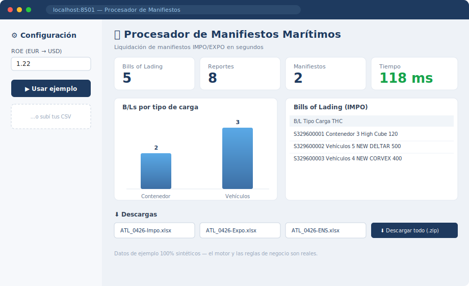
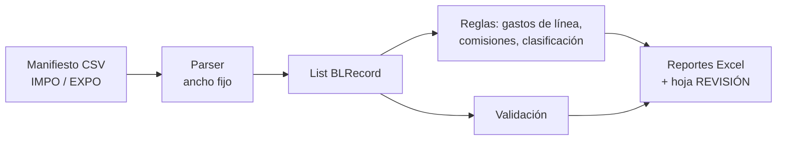

# 🚢 Procesador de Manifiestos Marítimos

> Motor en Python que lee manifiestos de carga marítima (IMPO/EXPO) y genera en
> **segundos** las planillas de liquidación que una agencia hacía manualmente en
> horas: gastos de línea, comisiones, ENS, chasis y resúmenes por B/L y por marca.


[](https://github.com/toomastorres/maritime-manifest-processor/actions/workflows/ci.yml)

🔗 **Demo en vivo:** _(añadir URL de Streamlit Community Cloud tras el deploy)_



> ℹ️ **Sobre los datos:** el motor y las reglas de negocio son reales, pero todos
> los manifiestos de ejemplo (`samples/`) son **sintéticos** — no contienen datos
> de ningún cliente. Proyecto derivado de una herramienta interna, anonimizado
> para portafolio.

---

## El problema

Una agencia marítima recibe, por cada viaje de buque, manifiestos de cientos de
Bills of Lading en un export de texto de ancho fijo difícil de leer. Liquidar el
viaje (calcular fletes, THC, peajes/TOLL, sweeping, comisiones por tipo de carga,
notas de débito ENS y trazar los VIN de los autos) se hacía **a mano en planillas
Excel**, con horas de trabajo y riesgo de error por viaje.

Este motor **parsea el manifiesto y emite las planillas automáticamente**, dejando
en cada una una hoja `REVISIÓN` con los controles para validación humana.

## Qué genera (por viaje)

| Reporte | Contenido |
|---|---|
| **Planilla IMPO / EXPO** | Liquidación por puerto: THC (20/40), TOLL, sweeping, BAF, fletes y comisiones |
| **Comisiones IMPO / EXPO** | Desglose por tipo de carga: *rolling* 1%, *general* 2%/4%, contenedores 2%/4% + USD/ctr (ilustrativo) |
| **ENS** | Nota de débito (monto fijo por B/L) |
| **Por B/L** | Resumen financiero por conocimiento de embarque |
| **Por Marca / Chasis** | Cantidades y montos por marca; trazabilidad de VIN de vehículos |

## Arquitectura

Reescritura modular de un script monolítico previo (~1.600 líneas) a un paquete
con responsabilidades separadas:

```
manifest_engine/
├── domain/      # Modelo tipado (BLRecord, Charge, CargoData) + clasificación de carga
├── parsing/     # ManifestParser: CSV de ancho fijo → List[BLRecord] (IMPO/EXPO)
├── rules/       # Reglas de negocio: gastos de línea, comisiones, "biblias"
├── reports/     # Escritores Excel (openpyxl) de cada planilla
├── config.py    # Única fuente de verdad de parámetros modificables (tarifas, rates, mapeos)
├── validation.py / verification.py  # Acumulación de discrepancias + harness de diff
└── __main__.py  # CLI / batch
```

### Pipeline



Decisiones de diseño destacadas:
- **`config.py` como única fuente de verdad**: el negocio puede cambiar tarifas,
  rates de comisión y mapeos de marca sin tocar la lógica.
- **Parsing tolerante**: maneja descripciones "envueltas" en varias líneas,
  cargos estructurados (`FACTOR/BASIS/RATE`) y desambiguación de THC por tarifa.
- **Validación separada del cálculo**: las discrepancias van a una hoja `REVISIÓN`
  en vez de corromper el reporte.

Más detalle en [DOCUMENTACION.md](DOCUMENTACION.md) y las reglas en
[reglas_de_negocio.md](reglas_de_negocio.md).

## Uso

```bash
pip install -r requirements.txt

# 1) Generar manifiestos de ejemplo sintéticos
python tools/generate_samples.py samples

# 2) Procesar (pide el ROE EUR→USD; Enter usa el valor por defecto)
python -m manifest_engine samples out

# 3) Ver los .xlsx en out/
```

### Demo web (Streamlit)

```bash
streamlit run streamlit_app.py
```

Demo interactiva: subí tus CSV o usá los de ejemplo y obtené **métricas** (B/Ls,
reportes, tiempo), **tablas** de los Bills of Lading parseados (carga, THC, VINs),
**gráficos** por tipo de carga y operación, y la **descarga** de cada reporte Excel.

### Tests

```bash
pip install -r requirements-dev.txt
pytest -q          # 8 pruebas: parsing, clasificación, VIN/marca, reportes end-to-end
```

Se corren en CI ([.github/workflows/ci.yml](.github/workflows/ci.yml)) en cada push.

## Stack

Python 3.10+ · `openpyxl` (Excel) · `dataclasses` / `typing` · Streamlit (demo) ·
expresiones regulares para el parsing de ancho fijo.

## ♻️ ¿A quién le sirve / cómo reutilizarlo?

Sirve como base para **parsear archivos de texto/ancho-fijo y generar reportes Excel** en cualquier dominio.
Para adaptarlo: cambiá los patrones del parser en `manifest_engine/parsing/` y las tarifas/reglas en
`config.py` (única fuente de verdad), y reutilizá los escritores de `reports/`. El wrapper de Streamlit
(`streamlit_app.py`) te da una demo web sin tocar el motor.
